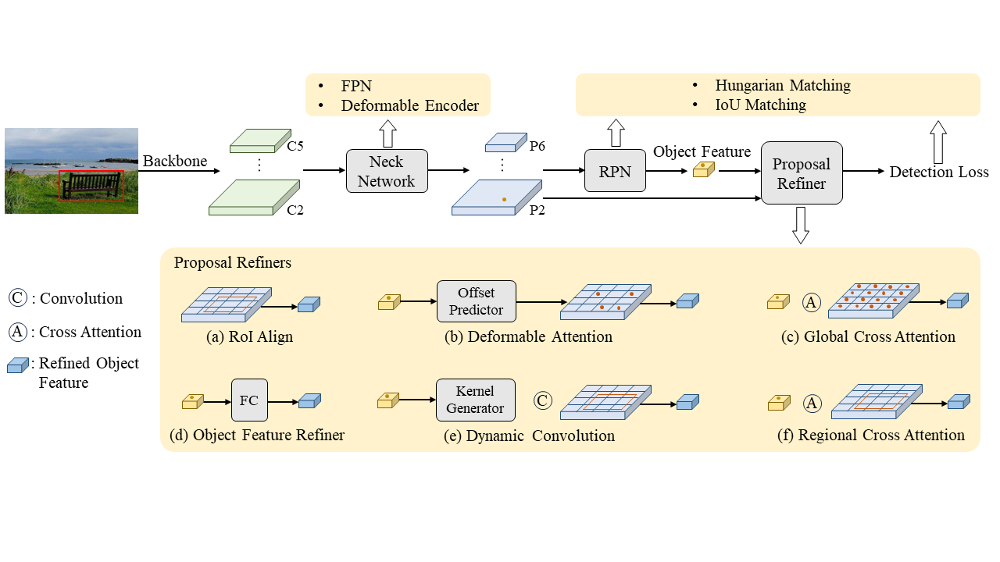

# Hybrid Proposal Reginer

This is the official implementation of the paper "Hybrid Proposal Refiner: Revisiting DETR Series from the Faster R-CNN Perspective". 

> [**Hybrid Proposal Refiner: Revisiting DETR Series from the Faster R-CNN Perspective**]()

> Jinjing Zhao*, Fangyun Wei*, Chang Xu

> The University of Sydney

## TODO
- [ ] Update the checkpoints

## Introduction

With the transformative impact of the Transformer, DETR pioneered the application of the encoder-decoder architecture to object detection. A collection of follow-up research, e.g., Deformable DETR, aims to enhance DETR while adhering to the encoder-decoder design. In this work, we revisit the DETR series through the lens of Faster R-CNN. We find that the DETR resonates with the underlying principles of Faster R-CNN's RPN-refiner design but benefits from end-to-end detection owing to the incorporation of Hungarian matching. We systematically adapt the Faster R-CNN towards the Deformable DETR, by integrating or repurposing each component of Deformable DETR, and note that Deformable DETR's improved performance over Faster R-CNN is attributed to the adoption of advanced modules such as a superior proposal refiner (e.g., deformable attention rather than RoI Align). When viewing the DETR through the RPN-refiner paradigm, we delve into various proposal refinement techniques such as deformable attention, cross attention, and dynamic convolution. These proposal refiners cooperate well with each other; thus, we synergistically combine them to establish a Hybrid Proposal Refiner (HPR). Our HPR is versatile and can be incorporated into various DETR detectors. For instance, by integrating HPR to a strong DETR detector,  we achieve an AP of 54.9 on the COCO benchmark, utilizing a ResNet-50 backbone and a 36-epoch training schedule.

<div align=center>  

</div>

## Main Results

### Results on COCO with **ResNet-50**
| Base Model      | Epoch | w/LSJ |   AP  | Configs | Checkpoints |
|:---------------:|:-----:|:-----:|:-----:|:-------:|:-----------:|
| Deformable DETR | 12    |       | 50.6  |[config](project/configs/deformable_detr-900q_4scale_1x_r50.py)   | [link](https://pan.quark.cn/s/2cdd562d5486) |
| Deformable DETR | 24    |       | 51.9  |[config](project/configs/deformable_detr-900q_4scale_2x_r50.py)   | [link](https://pan.quark.cn/s/2cdd562d5486) |
| DINO            | 12    |       | 51.1  |[config](project/configs/dino-900q_4scale_1x_r50.py)              | [link](https://pan.quark.cn/s/2cdd562d5486) |
| DINO            | 24    |       | 51.9  |[config](project/configs/dino-900q_4scale_2x_r50.py)              | [link](https://pan.quark.cn/s/2cdd562d5486) |
| Align DETR      | 12    |       | 52.1  |[config](project/configs/align_detr-900q_4scale_1x_r50.py)        | - |
| Align DETR      | 24    |       | 52.7  |[config](project/configs/align_detr-900q_4scale_2x_r50.py)        | - |
| Align DETR      | 12    | √     | 52.7*|[config](project/configs/align_detr-lsj_900q_4scale_1x_r50.py)    | [link](https://pan.quark.cn/s/2cdd562d5486) |
| Align DETR      | 24    | √     | 54.6*|[config](project/configs/align_detr-lsj_900q_4scale_2x_r50.py)    | [link](https://pan.quark.cn/s/2cdd562d5486) |
| Align DETR      | 36    | √     | **55.2***  |[config](project/configs/align_detr-lsj_900q_4scale_3x_r50.py)    | [link](https://pan.quark.cn/s/2cdd562d5486) |
| DDQ             | 12    |       | 52.6*|[config](project/configs/ddq_300q_4scale_1x_r50.py)               | [link](https://pan.quark.cn/s/2cdd562d5486) |
| DDQ             | 24    |       | 53.3*|[config](project/configs/ddq_300q_4scale_2x_r50.py)               | [link](https://pan.quark.cn/s/2cdd562d5486) |
| DDQ             | 12    | √     | 53.0 |[config](project/configs/ddq-lsj_300q_4scale_1x_r50.py)           | [link](https://pan.quark.cn/s/2cdd562d5486) |
| DDQ             | 24    | √     | 54.8*|[config](project/configs/ddq-lsj_300q_4scale_2x_r50.py)           | [link](https://pan.quark.cn/s/2cdd562d5486) |
| DDQ             | 36    | √     | **55.1*** |[config](project/configs/ddq-lsj_300q_4scale_3x_r50.py)        | [link](https://pan.quark.cn/s/2cdd562d5486) |


### Results on COCO with **Swin-Large**
| Base Model      | Epoch | w/LSJ |   AP  | Configs | Checkpoints |
|:---------------:|:-----:|:-----:|:-----:|:-------:|:-----------:|
| DDQ             | 12    |       | 58.7  |[config](project/configs/ddq_300q_4scale_1x_swinL.py)               | [link](https://pan.quark.cn/s/2cdd562d5486) |
| DDQ             | 12    | √     | 58.8* |[config](project/configs/ddq-lsj_300q_4scale_1x_swinL.py)           | [link](https://pan.quark.cn/s/2cdd562d5486) |
| DDQ             | 24    | √     | 59.7* |[config](project/configs/ddq-lsj_300q_4scale_2x_swinL.py)           | [link](https://pan.quark.cn/s/2cdd562d5486) |
| Align DETR      | 12    |       | 58.6  |[config](project/configs/align_detr-900q_4scale_1x_swinL.py)        | [link](https://pan.quark.cn/s/2cdd562d5486) |
| Align DETR      | 24    |       | 59.3  |[config](project/configs/align_detr-900q_4scale_2x_swinL.py)        | [link](https://pan.quark.cn/s/2cdd562d5486) |
| Align DETR      | 12    | √     | 58.8  |[config](project/configs/align_detr-lsj_900q_4scale_1x_swinL.py)    | [link](https://pan.quark.cn/s/2cdd562d5486) |
| Align DETR      | 24    | √     | 59.6  |[config](project/configs/align_detr-lsj_900q_4scale_2x_swinL.py)    | [link](https://pan.quark.cn/s/2cdd562d5486) |
| Align DETR      | 36    | √     | **60.0**  |[config](project/configs/align_detr-lsj_900q_4scale_3x_swinL.py)    | [link](https://pan.quark.cn/s/2cdd562d5486) |

\* Retrained this configuration, the result is slightly higher than what we reported in the paper.
## Installation
We test our models under ```python=3.10.10, pytorch=1.12.0,cuda=11.6```. Other versions might be available as well.

1. Install Pytorch and torchvision

Follow the instruction on https://pytorch.org/get-started/locally/.
```sh
# an example:
conda install -c pytorch pytorch torchvision
```

2. Install other needed packages
```sh
pip install -r requirements.txt
```


## Data

Please download [COCO 2017](https://cocodataset.org/) dataset and organize them as following:
```
coco2017/
  ├── train2017/
  ├── val2017/
  └── annotations/
  	├── instances_train2017.json
  	└── instances_val2017.json
```
## Run
### Modify COCO path in config file
Before training or evaluation, you need to modify the dataset path in following config files:

```bash
project/configs/_base_/datasets/data_re_aug_coco_detection.py
project/configs/_base_/datasets/lsj_data_re_aug_coco_detection.py
```

### To train a model on single node
To accelerate convergence, we apply the [SoCo](https://arxiv.org/abs/2106.02637) pretrain on the ResNet-50 backbone (`./backbone_pth/backbone.pth`).
```Bash
./dist_train.sh <Config Path> <GPU Number> <Work Dir>
```


### To eval a model on single node

```Bash
./dist_test.sh <Config Path> <Checkpoint Path> <GPU Number>
```

### Multi-node training

You can refer to [Deformable-DETR](https://github.com/fundamentalvision/Deformable-DETR) to enable training on multiple nodes.

## Citation

If you use HPR in your research or wish to refer to the baseline results published here, please use the following BibTeX entry.
